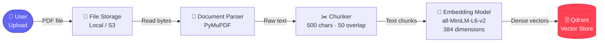
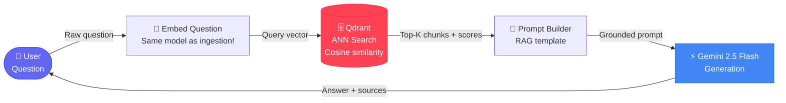

<div align="center">


### *Upload documents. Ask anything. Get grounded, citable answers — not hallucinations.*

<br/>

[](https://python.org)
[](https://fastapi.tiangolo.com/)
[](https://qdrant.tech/)
[](https://docker.com)
[](https://ai.google.dev/)
[](https://sbert.net/)
[](LICENSE)

<br/>

> *"I built a document-grounded QA system. The core design challenge was: how do you retrieve semantically relevant context at query time without scanning the entire corpus? Dense vector retrieval. Ingestion and generation are decoupled, which means I can swap the LLM without touching the embedding pipeline."*
>


<br/>

</div>

---

## 📖 Table of Contents

- [What This Actually Is](#-what-this-actually-is)
- [Why This Project Matters](#-why-this-project-matters-in-industry)
- [The Architecture](#-the-architecture)
  - [Flow 1 — Ingestion Pipeline](#flow-1--ingestion-pipeline-async)
  - [Flow 2 — Query Pipeline](#flow-2--query-pipeline-real-time)
  - [The Vector Store Is the Pivot Point](#the-vector-store-is-the-pivot-point)
- [Tech Stack — And Why Each Choice Was Made](#-tech-stack--and-why-each-choice-was-made)
- [Project Structure](#-project-structure)
- [Getting Started](#-getting-started)
  - [Prerequisites](#prerequisites)
  - [Local Development (without Docker)](#option-a-local-development)
  - [Docker Compose (recommended)](#option-b-docker-compose-recommended)
- [API Reference](#-api-reference)
- [Configuration](#-configuration)
- [The Engineering Decisions Worth Defending](#-the-engineering-decisions-worth-defending)
- [Roadmap](#-roadmap)
- [Known Limitations & Future Work](#-known-limitations--future-work)
- [Author](#-author)

---

## 🎯 What This Actually Is

This is a **production-structured Retrieval-Augmented Generation (RAG) system** — the dominant architecture that every serious AI product company is building internally right now.

You upload PDFs. You ask questions. It returns answers grounded exclusively in your uploaded documents, with citations showing exactly which source each part of the answer came from. No hallucinations. No training data bleed. Just what your documents actually say.

**Under the hood:**
- Documents are parsed, chunked, and converted to 384-dimensional dense vectors at upload time (async, non-blocking)
- At query time, your question is embedded into the same vector space and a nearest-neighbor search retrieves the most semantically relevant chunks in milliseconds
- Those chunks are injected into a carefully engineered prompt, and Gemini generates a grounded answer that it cannot fabricate

This is not a chatbot wrapper. This is a **system**.

---

## 🏭 Why This Project Matters in Industry

When a law firm needs AI to answer questions about contracts — this is what they build.  
When a hospital needs AI over patient notes — this is what they build.  
When a company needs an internal knowledge base that actually knows their docs — this is what they build.

RAG is the dominant architecture for **enterprise AI in 2024–2026**. Every company with internal documents and a product requirement to "make AI answer questions about them" is implementing some version of this pipeline.

This project sits at the intersection of three disciplines that are actively hiring:

| Discipline | What You're Demonstrating |
|---|---|
| **AI Systems Engineering** | Designing a full pipeline: ingest → chunk → embed → store → retrieve → generate. Every stage has latency, failure modes, and scaling concerns. |
| **Backend Engineering** | Real async APIs, file processing, background tasks, request lifecycle management — not toy CRUD. |
| **MLOps / AI Infrastructure** | Containerized services, model versioning awareness, deployment-ready architecture, CI/CD readiness. |

The roles this unlocks: *AI Engineer · Backend Engineer (AI-focused) · MLOps Engineer · Cloud Infrastructure Engineer · Solutions Architect (AI/ML)*

---

## 🏗️ The Architecture

Every RAG system has exactly two distinct flows. Understanding them — and why they're separate — is the difference between an engineer and someone who followed a tutorial.

### Flow 1 — Ingestion Pipeline *(async)*

> *Happens when a document is uploaded. Heavy. Can be slow. Must not block user queries.*



**Steps in plain English:**
1. User uploads a PDF → saved to disk, `202 Accepted` returned immediately
2. Background task kicks off: PyMuPDF extracts raw text
3. Text is split into overlapping 500-char chunks (overlap preserves cross-boundary context)
4. Each chunk is converted to a 384-dim vector by a local embedding model (no API call)
5. Vectors + metadata (filename, document_id, chunk_text, timestamp) upserted into Qdrant

---

### Flow 2 — Query Pipeline *(real-time)*

> *Happens when a user asks a question. Must be fast. Returns in < 2 seconds.*



**Steps in plain English:**
1. Question arrives → embedded using the **same model** as ingestion (critical — mismatched models break everything)
2. Qdrant performs Approximate Nearest Neighbor search, returns top-K most similar chunks by cosine distance
3. Chunks are formatted into a prompt with strict instructions: *answer only from context, cite sources*
4. Gemini generates the answer
5. Response returned with answer text, source chunks, and latency_ms

---

### The Vector Store Is the Pivot Point

Both pipelines converge on Qdrant. Ingestion **writes** to it. Querying **reads** from it. Everything else exists to serve that central operation.

This is what architecturally separates RAG from a chatbot: **knowledge is pre-indexed, not passed in at runtime.** At query time, you're not scanning documents — you're doing a nearest-neighbor lookup in a pre-built geometric index. That's why it's fast.

---

## ⚙️ Tech Stack — And Why Each Choice Was Made

Every technology here was chosen for a reason. In an interview, you should be able to defend each one.

| Component | Technology | Why This, Not Something Else |
|---|---|---|
| **API Framework** | FastAPI 0.111 | Async-native, Pydantic validation built in, auto-generates OpenAPI docs. Django is too heavy. Flask has no async story. FastAPI is what production AI APIs are actually built on. |
| **Vector Database** | Qdrant | Text similarity is a geometric problem, not a filter problem. SQL has no native operator for nearest-neighbor search in 384-dim space. Qdrant uses HNSW indexing for sub-millisecond ANN search. Self-hostable (vs. Pinecone's SaaS lock-in). |
| **Embedding Model** | all-MiniLM-L6-v2 | 90MB, runs on CPU, 384 dimensions, strong retrieval quality for its size. No API key, no latency, no cost per token. In production you'd evaluate against larger models — this is the sensible default. |
| **LLM** | Google Gemini 2.5 Flash | Fast, cheap, long context window. The LLM is intentionally swappable — it's behind a single `generate_answer()` function. Swap to GPT-4, Claude, or a local Ollama model without touching the retrieval pipeline. |
| **PDF Parser** | PyMuPDF (fitz) | Fastest pure-Python PDF parser. Handles most commercial PDF structures. Falls back gracefully. Scanned PDFs need OCR — that's a known extension point. |
| **Settings Management** | Pydantic-Settings | Type-safe env var loading with `.env` support. Catches missing API keys at startup, not at runtime when a user hits an endpoint. |
| **Containerization** | Docker + Compose | Reproducible environment. One command brings up both the app and vector DB. The `depends_on: condition: service_healthy` ensures Qdrant is ready before the app accepts traffic. |

---

## 📁 Project Structure

```
rag-knowledge-assistant/
│
├── app/
│   ├── main.py                 # FastAPI app entry point, lifespan hook, /health
│   ├── config.py               # Pydantic-settings: all config via env vars
│   │
│   ├── api/
│   │   └── routers/
│   │       ├── documents.py    # POST /documents/upload, GET /documents, DELETE
│   │       └── query.py        # POST /query — the core RAG endpoint
│   │
│   ├── db/
│   │   └── qdrant.py           # Client singleton (lru_cache), collection bootstrap
│   │
│   ├── models/
│   │   └── schemas.py          # All Pydantic request/response models
│   │
│   ├── services/
│   │   ├── ingestor.py         # PDF → text → chunks → vectors → Qdrant
│   │   ├── retriever.py        # Question → vector → ANN search → chunks
│   │   └── generator.py        # Chunks + question → RAG prompt → Gemini → answer
│   │
│   └── utils/
│       └── chunker.py          # Overlapping character-based text splitter
│
├── tests/                      # Test suite (Phase 6)
│
├── .env.example                # Template — copy to .env, fill in keys
├── .gitignore                  # .env, uploads/, venv/ excluded
├── Dockerfile                  # python:3.11-slim, non-root user, layer-cached deps
├── docker-compose.yml          # App + Qdrant, health checks, named volumes
└── requirements.txt
```

**The separation of concerns is intentional and interview-ready:**
- `services/` contains all business logic — no FastAPI imports, fully testable in isolation
- `api/routers/` contains only HTTP concerns — validation, status codes, background tasks
- `db/` owns all Qdrant interactions — swap vector DBs by changing one file
- `models/schemas.py` is the single source of truth for data shapes

---

## 🚀 Getting Started

### Prerequisites

- Python 3.11+
- Docker & Docker Compose (for the recommended setup)
- A Gemini API key — get one free at [aistudio.google.com](https://aistudio.google.com/)

### Environment Setup

```bash
# Clone the repository
git clone https://github.com/hammadmalik17/rag-knowledge-assistant.git
cd rag-knowledge-assistant

# Copy the environment template
cp .env.example .env

# Fill in your Gemini API key
# Open .env and set: GEMINI_API_KEY=your_key_here
```

---

### Option A: Local Development

> Use this when you want fast iteration — edit code, restart, see changes immediately.

```bash
# Create and activate virtual environment
python -m venv .venv
source .venv/bin/activate          # Windows: .venv\Scripts\activate

# Install dependencies
pip install -r requirements.txt

# Start Qdrant separately (still needs Docker for the vector DB)
docker run -p 6333:6333 qdrant/qdrant:v1.10.0

# Run the FastAPI app
uvicorn app.main:app --reload --host 0.0.0.0 --port 8000
```

App live at: `http://localhost:8000`  
Interactive API docs: `http://localhost:8000/docs`

---

### Option B: Docker Compose *(recommended)*

> One command. Both services. Health checks. Persisted volumes. Production-like.

```bash
# Build and start everything
docker compose up --build

# Run in background
docker compose up --build -d

# View logs
docker compose logs -f app

# Tear down (keeps volumes)
docker compose down

# Tear down + wipe all data
docker compose down -v
```

App live at: `http://localhost:8000`  
Qdrant dashboard at: `http://localhost:6333/dashboard`

**What happens on startup:**
1. Qdrant container starts and passes its health check
2. FastAPI app starts, `ensure_collection_exists()` runs
3. If the Qdrant collection doesn't exist, it's created with the right vector config (384 dims, cosine distance)
4. App is ready — Qdrant is guaranteed up before the first request is served

---

## 📡 API Reference

### Health Check

```http
GET /health
```

```json
{
  "status": "ok",
  "vector_db": "up",
  "version": "0.1.0",
  "uptime_s": 142
}
```

*Returns `"status": "degraded"` if Qdrant is unreachable. Used by Docker health checks and load balancers.*

---

### Upload a Document

```http
POST /documents/upload
Content-Type: multipart/form-data
```

```bash
curl -X POST http://localhost:8000/documents/upload \
  -F "file=@your_document.pdf"
```

```json
{
  "document_id": "a3f1c2d4-...",
  "filename": "your_document.pdf",
  "status": "processing"
}
```

*Returns `202 Accepted` immediately. Ingestion runs in the background. Poll the status endpoint to know when it's ready.*

> **Why 202 and not 200?**  
> Embedding a large document can take 5–30 seconds. Blocking the HTTP connection for that long is poor API design. `202` tells the client: "I received it, work is in progress." This is the correct REST semantics for async operations.

---

### Check Ingestion Status

```http
GET /documents/{document_id}/status
```

```bash
curl http://localhost:8000/documents/a3f1c2d4-.../status
```

```json
{
  "document_id": "a3f1c2d4-...",
  "filename": "your_document.pdf",
  "status": "done",
  "chunk_count": 47,
  "error": null,
  "created_at": "2025-01-15T10:30:00Z"
}
```

*`status` is one of: `"processing"` → `"done"` or `"failed"`*

---

### List All Documents

```http
GET /documents
```

```bash
curl http://localhost:8000/documents
```

Returns an array of `DocumentStatusResponse` objects for all documents in the registry.

---

### Delete a Document

```http
DELETE /documents/{document_id}
```

```bash
curl -X DELETE http://localhost:8000/documents/a3f1c2d4-...
```

```json
{
  "deleted": true,
  "chunks_removed": 47
}
```

*Deletes all Qdrant vectors whose `payload.document_id` matches — uses Qdrant's payload filter, not brute-force scan.*

---

### Ask a Question

```http
POST /query
Content-Type: application/json
```

```bash
curl -X POST http://localhost:8000/query \
  -H "Content-Type: application/json" \
  -d '{
    "question": "What are the main risks identified in the Q3 report?",
    "top_k": 5
  }'
```

```json
{
  "answer": "According to the Q3 report (financial_summary.pdf), the main risks identified are: ...",
  "sources": [
    {
      "chunk_text": "The primary risks facing operations in Q3 include...",
      "document_id": "a3f1c2d4-...",
      "filename": "financial_summary.pdf",
      "score": 0.8924
    }
  ],
  "latency_ms": 843
}
```

| Parameter | Type | Default | Description |
|---|---|---|---|
| `question` | string | required | Your question (1–1000 chars) |
| `top_k` | integer | 5 | How many chunks to retrieve (1–20) |

*The `score` field is the cosine similarity between the query vector and the chunk vector — higher is more relevant. Typically ranges from 0.6 (weak) to 0.95 (very strong).*

---

## 🔧 Configuration

All configuration is driven by environment variables (see `.env.example`):

| Variable | Default | Description |
|---|---|---|
| `GEMINI_API_KEY` | *required* | Your Google AI Studio API key |
| `GEMINI_MODEL` | `gemini-2.5-flash-lite` | Gemini model for generation |
| `QDRANT_HOST` | `localhost` | Qdrant host (`qdrant` when using Docker Compose) |
| `QDRANT_PORT` | `6333` | Qdrant REST port |
| `QDRANT_COLLECTION` | `rag_documents` | Collection name (like a table) |
| `EMBEDDING_MODEL` | `all-MiniLM-L6-v2` | Sentence transformer model name |
| `UPLOAD_DIR` | `uploads` | Directory for saved PDFs |
| `MAX_FILE_SIZE_MB` | `20` | Max upload size |
| `CHUNK_SIZE` | `500` | Characters per chunk |
| `CHUNK_OVERLAP` | `50` | Overlap between consecutive chunks |

> ⚠️ **Never commit `.env` to git.** The `.gitignore` already excludes it, but double-check before any push. Your API key is a secret.

---

## 🧪 The Engineering Decisions Worth Defending

These are the questions a senior engineer or interviewer will ask. Here are the honest, thoughtful answers.

---

**"Why chunk the document? Why not just embed the whole PDF?"**

Two reasons. First, embedding models have hard token limits (typically 512–8192 tokens) — a 50-page PDF won't fit. Second, and more importantly, retrieval precision degrades with chunk size. You want to retrieve the *paragraph* that answers the question, not a 50-page document where the relevant sentence is buried on page 31. Smaller chunks = higher retrieval precision. This is a precision/recall tradeoff, and 500 chars with 50-char overlap is a sensible starting point for most document types.

---

**"Why a vector database? Why not just store text in PostgreSQL and do LIKE queries?"**

Semantic search is a geometric problem, not a string-match problem. When a user asks *"what are the risks?"*, they won't use the exact word "risks" — they might say "threats", "vulnerabilities", "exposure". LIKE queries can't handle this. A vector DB stores each chunk as a point in 384-dimensional space. Similar *meanings* are geometrically close. Qdrant uses HNSW (Hierarchical Navigable Small World) indexing for Approximate Nearest Neighbor search — sub-millisecond lookups even with millions of vectors. SQL has no equivalent operator.

---

**"Why are ingestion and querying decoupled?"**

Ingestion is slow (parsing + embedding + writing), CPU-bound, and can be async. Queries are latency-sensitive — users expect sub-second responses. If they were tightly coupled, a user uploading a large PDF would block another user's question. Decoupling lets you scale them independently: spin up more ingestion workers when upload spikes, without over-provisioning query replicas. It also means you can add a message queue (Celery + Redis) between them later without touching the query path.

---

**"What happens if you change the embedding model?"**

Every stored vector becomes semantically incompatible with new queries. You can't partially re-index — you'd need to re-ingest every document from scratch. This is a real operational concern in production: embedding model versioning is as important as database schema migrations. The model name should be stored alongside collection metadata so you know what you're dealing with. This is a known limitation of the current design.

---

**"Why use Qdrant instead of Pinecone or pgvector?"**

Pinecone is a managed SaaS — you pay per vector and you can't self-host. That's vendor lock-in with a cost curve that gets expensive fast. pgvector (Postgres extension) is great but has scalability ceilings and doesn't have native HNSW optimizations at Qdrant's level. Qdrant is open-source, self-hostable, has a clean Python client, and supports payload filtering (which is how the delete endpoint works). For a portfolio project, it's the best balance of production-credibility and zero cost.

---

**"What's the failure mode if Gemini is down?"**

The `/query` endpoint would throw a 500 error. In production, you'd want: retry with exponential backoff, a fallback response ("The LLM service is temporarily unavailable — here are the raw relevant chunks"), and a circuit breaker. These are on the roadmap.

---

## 🗺️ Roadmap

This project is under active development. Here's the plan:

- [x] **Phase 1** — Architecture & Design *(complete)*
- [x] **Phase 2** — Core Backend: FastAPI, document upload, chunking *(complete)*
- [x] **Phase 3** — Embedding & Vector Store: Qdrant integration *(complete)*
- [x] **Phase 4** — Query Pipeline: Retrieval + Gemini generation *(complete)*
- [x] **Phase 5** — Containerization: Docker + Compose *(complete)*
- [ ] **Phase 6** — Observability & CI/CD: structured logging, request tracing, GitHub Actions
- [ ] **Phase 7** — Cloud Deployment: cloud provider, infrastructure as code, managed vector DB
- [ ] **Phase 8** — Evaluation Framework: retrieval precision metrics, answer faithfulness scoring
- [ ] **Phase 9** — Advanced Retrieval: hybrid search (dense + sparse BM25), re-ranking
- [ ] **Phase 10** — Production Hardening: persistent document registry (PostgreSQL), auth, rate limiting

---

## ⚠️ Known Limitations & Future Work

These aren't bugs — they're deliberate simplifications that are documented and understood. In an interview, naming these proactively signals engineering maturity.

| Limitation | Current State | Production Solution |
|---|---|---|
| **Document Registry** | In-memory Python dict — lost on restart | PostgreSQL or Redis with a proper schema |
| **Chunking Strategy** | Character-based, fixed size | Token-aware splitting, semantic chunking, sentence boundary detection |
| **Scanned PDFs** | Not supported (no OCR) | Tesseract OCR pre-processing step |
| **Embedding Model Version** | Not stored with collection | Version metadata in Qdrant collection config |
| **No Auth** | All endpoints are public | API key middleware or JWT auth |
| **No Rate Limiting** | Unbounded uploads | Per-IP rate limiting, upload queue with backpressure |
| **Single Collection** | All users share one namespace | Per-user collections or payload-filtered isolation |
| **No Evaluation** | No retrieval quality metrics | RAGAS or custom precision/recall benchmarks |

---

## 👤 Author

<div align="center">

**Hammad Malik**

Built with curiosity, caffeine, and a healthy respect for what the data actually says.

[](https://github.com/hammadmalik17/)
[](https://www.linkedin.com/in/hammad-malik-)

</div>

<br/>

---

<div align="center">

*If this project helped you understand RAG, gave you interview ammunition, or made you think harder about system design — that's the whole point.*

⭐ Star it. Fork it. Break it. Rebuild it better.

</div>

